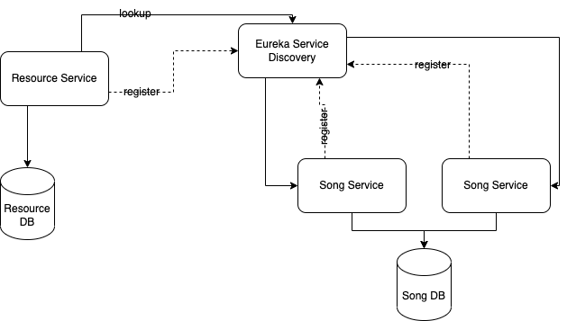

# Table of Content

- [01 - What to do](#01---what-to-do)
- [02 - Sub-task: Service registry](#02---sub-task-service-registry)
- [03 - Project configuration](#03---project-configuration)
    * [Project Structure](#structure)
    * [Running the application](#running-the-application)
      * [Manual Running](#manual-running)
      * [Automated Running](#automated-running)

## 01 - What to do

In this task you need to choose one of Service registry tool and inject it into your infrastructure.
Please, find the sample implementation here: [Eureka Example](https://www.javainuse.com/spring/cloud-gateway-eureka)

## 02 - Sub-task: Service registry

1) Use Eureka Service Registry ([Service Registration and Discovery](https://spring.io/guides/gs/service-registration-and-discovery/)).
2) All microservices should be Eureka Clients, and they must be registered with the Eureka Server (made up of the Load Balancer and the Service Registry).

## 03 - Project configuration

### Structure
1) **Eureka Service** (Netflix Eureka Discovery Service)
   * Used to register the service location (service host)
2) **Gateway Service**
   * Used to be the only entery point of the application
       * Receving the request.
       * Checking the resourse path.
       * Pickup the right service.
       * Redirect the call to that service.
3) **Resource Service**
   * Used to store the binary representation of the resource, currentlly MP3 only.
4) **ResourceMetadata Service**
    * Used to store the Metadata representation of the resource, currentlly MP3 only.
  
### Running the application

#### Manual Running
* Before running the application you need to start Docker deamon (docker disktop).
* Run docker-compose file from resource or resourcemetadata project, both files doing the same action
  * Starting the PostgreSql
  * Starting the PgAdmin.
* Running options
  * From CMD, navigate to each project then run `mvn clean spring-boot:run`
  * From Idea, just import the project then run the main class of each project.
* You can use [postman application](https://www.postman.com/) to test the endpoints and to interact with the application.
* Uploaded [Postman collection](Postman_Collections/) to make easy for tesating the api. 

#### Automated Running
* Before running the application you need to start Docker deamon (docker disktop).
* Run [RunServices.bat](RunServices.bat) from the root folder.
  * You can read the structure of the file, it is simple.
  * The batch will run the applications in sequence.
  * check that there is a didcated cmd instance for each application, in total 4 cmd.
* You can use [postman application](https://www.postman.com/) to test the endpoints and to interact with the application.
* Uploaded [Postman collection](Postman_Collections/) to make easy for tesating the api.     

 

