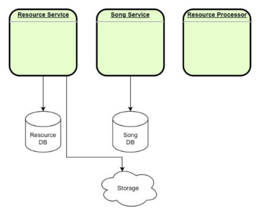

# Table of Content

- [01 - What to do](#01---what-to-do)
- [02 - Project configuration](#02---project-configuration)
    * [Project Structure](#structure)

## 01 - What to do

* build microservice system to store resources made as follow;
   * [Resource Service](resource): to store resources in Cloud (AWS S3).
   * [Resource Processor Service](resource_processor): to extract and store the resource metadata.
   * [Song Service](song):
      * It will work as the entery point to store files. 
      * Recieving MP3 file.
      * Coonect to Resource service to store the file in Cloud service.
      * Connect to Resource Processor to extract and to store resource metadata.

## 02 - Project configuration

### Structure
* Check each project ReadME file for details of runnig.
* At the moment each project works separately.
* The communication will be done in the subsequent implementations. 

 

